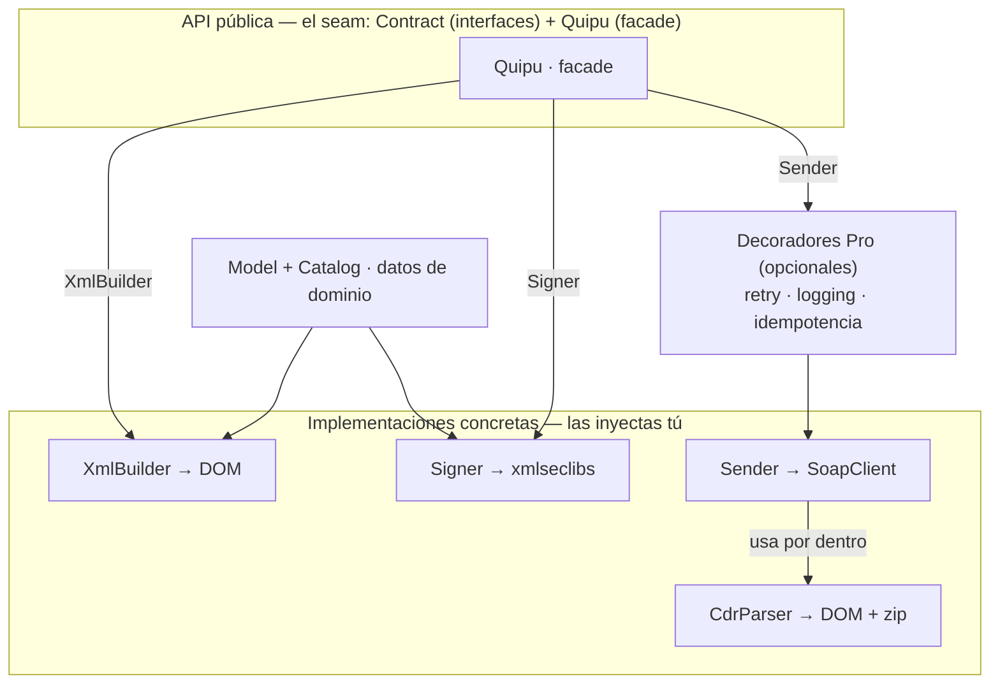

# Arquitectura

quipu se organiza en **módulos con responsabilidades claras**, expuestos tras un **seam público** de interfaces
y value objects. El consumidor depende de las abstracciones, nunca de las clases concretas de firma o transporte.

## Módulos internos

Todos bajo el namespace `ElPandaPe\Quipu\`:

```
ElPandaPe\Quipu\
├── Model\        # DTOs readonly de dominio (Invoice, Company, Client, SaleDetail, Legend…)
├── Catalog\      # Enums de los catálogos SUNAT (tipo de doc, moneda, unidad, afectación IGV…)
├── Xml\          # Builders: Model → XML UBL 2.1 o 2.0 según el tipo. Lectores: XML → Model.
├── Signer\       # Firma xmldsig enveloped dentro de UBLExtensions.
├── Ws\           # Transporte SOAP (SoapSender) y REST (GreClient) a SUNAT.
├── Cdr\          # Parser del CDR (unzip → ApplicationResponse → CdrResult tipado).
├── Validation\   # Validadores de reglas de negocio de SUNAT antes de firmar.
├── Contract\     # Interfaces públicas (Signer, Sender, XmlBuilder…). El SEAM.
├── Result\       # Value objects tipados de salida (SignedXml, BillResult, CdrResult…).
├── Exception\    # Jerarquía de excepciones de dominio (QuipuException + específicas).
├── Error\        # Catálogo oficial de códigos de error de SUNAT (ErrorCatalog: código → mensaje).
├── Presentation\ # Vista de impresión y string QR para la representación impresa.
├── Reference\    # Repositorio de catálogos tabulares (país, unidades de medida, UBIGEO).
├── Support\      # Value objects de soporte (Money…).
└── Quipu.php     # Facade público que compone todo (build → sign → send → parse).
```

## Diagrama de capas



La fila de arriba es la **frontera pública** (`Contract\*` + el facade `Quipu`); la de abajo son las
**implementaciones concretas**. Entre el facade y el `Sender` puede intercalarse una capa **opcional** de
[decoradores de **quipu Pro**](/pro/infra) <Availability pro /> —retry, logging e idempotencia— sin que el
dominio se entere: envuelven el `Contract\Sender` respetando la misma interfaz. No confundas
unas con otras: `Xml\CompositeBuilder` implementa `Contract\XmlBuilder`, `Signer\XmlSecSigner` implementa
`Contract\Signer` y `Ws\SoapSender` implementa `Contract\Sender` — esas tres **las inyectas tú** al construir
el facade (no tienen valor por default). `Cdr\CdrParser` es la excepción: no tiene interfaz en `Contract\` y
queda **detrás** del sender, que lo usa por dentro para convertir el zip del CDR en un `Result\CdrResult`.

## El seam (frontera pública)

Todo lo que el consumidor toca son **interfaces** (`Contract\`) y **value objects** (`Model\*`, `Result\*`),
nunca las clases concretas de firma o transporte:

- `Contract\Document` — el **tipo de entrada** de casi toda la API: lo implementan los `Model\*` (`Invoice`,
  `Note`, `Despatch`…) y expone `documentType(): DocumentType` y `fileName(): string` (el nombre base del
  archivo SUNAT, p. ej. `20000000001-01-F001-1`). Es lo que reciben builder, validadores y fachada.
- `Contract\XmlBuilder` — `build(Document): string` (XML sin firmar).
- `Contract\Signer` — `sign(string $xml): SignedXml` (XML firmado + digest).
- `Contract\Sender` — `sendBill`, `sendSummary`, `sendPack`, `getStatus`, `getPackStatus`.
- `Contract\Validator` — `errorsFor(Document): list<string>` (violaciones de reglas de SUNAT).
- `Contract\SchemaValidator` — validación contra el XSD de SUNAT, con dos métodos:
  `assertValid(Document, string $xml): void` (lanza `InvalidDocumentException`) y
  `errorsFor(Document, string $xml): array` (devuelve las violaciones; es el que usa la fachada).
- `Contract\DocumentReader` — `read(string $xml): Document` (XML → Model, inverso de build, salvo la GRE del
  transportista `CarrierDespatch`, tipoDoc 31, que aún no tiene lector y lanza `InvalidDocumentException`).
- `Contract\QrEncoder` — `encode(Document, SignedXml): string` (el string del QR de SUNAT).
- `Contract\PrintViewBuilder` — `build(Document, SignedXml): PrintView` (la vista de impresión tipada).
- `Quipu` (facade) orquesta todo.

Alrededor de ese núcleo hay contratos **periféricos**, que solo tocas si usas la función que cubren:
`Contract\GreSender` (guías de remisión por REST), `Contract\CpeValidator` (consulta de validez de CPE de
terceros), `Contract\CpeStatusService` (estado de tu propio CPE), y los de soporte `Contract\Clock`,
`Contract\HttpClient` y `Contract\TokenStore` (reloj inyectable, transporte HTTP y caché del token OAuth).

> [!IMPORTANT]
> Las implementaciones reales (`Signer\XmlSecSigner`, `Ws\SoapSender`) se **inyectan por constructor**. Así el
> consumidor las **mockea** en tests y puede sustituir el transporte sin tocar el dominio. El facade **nunca**
> instancia `new SoapClient` por dentro de forma oculta.

## Decisiones técnicas

| Concern | Decisión | Por qué |
|---|---|---|
| Firma xmldsig | `robrichards/xmlseclibs` | La canonicalización C14N y la cripto son un campo minado; se usa la librería estándar. Nunca se implementa cripto a mano. |
| Transporte SOAP | `SoapClient` de PHP + WS-Security | Nativo de PHP; SUNAT usa SOAP 1.1 con UsernameToken. |
| Construcción del XML | Propia, con DOM | Es donde vive el valor y el aprendizaje; se construye a mano siguiendo los esquemas y guías de SUNAT. |
| Parser CDR | Propio, con DOM + zip | El CDR es un ApplicationResponse UBL simple dentro de un zip. |
| Fechas | `DateTimeImmutable` | Inmutabilidad; el "día tributario" se corta en `America/Lima`. |

## Qué NO va en el core

Persistencia, correlativos, estados, *scheduling*, configuración de framework y PDF. Todo eso es del
consumidor. quipu recibe un `Model\*` ya armado (implementa `Contract\Document`) y devuelve un `Result\*`; no
sabe de bases de datos.

## Siguiente paso

Profundiza en el [facade Quipu](/arquitectura/facade) para ver todos los métodos disponibles.
