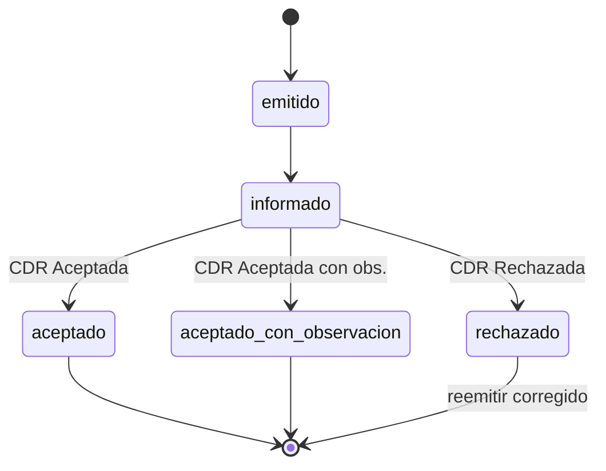

# CDR y ciclo de vida

El **CDR** (Constancia de Recepción) es la respuesta de SUNAT que acredita qué hizo con el comprobante enviado.
Sin un CDR aceptado, un comprobante no está plenamente informado. Esta página describe los estados, el manejo
de rechazos y el ciclo de vida —conceptos de dominio que quipu refleja en sus `Result\*`.

## Los tres estados del CDR

| Estado | `CdrStatus` | Significado | Validez |
|---|---|---|---|
| Aceptada | `Accepted` | SUNAT validó el comprobante | Válido, plena validez |
| Aceptada con observación | `AcceptedWithObservations` | Válido, con datos reparables | Válido; corregir en futuras emisiones |
| Rechazada | `Rejected` | No aceptado | **Sin validez** → emitir uno nuevo corregido |

quipu parsea el CDR y devuelve un `Result\CdrResult` con el estado, el código de respuesta, la descripción, las
observaciones y la severidad. Ver [resultados](/referencia/resultados).

## Envío individual — CDR por comprobante (síncrono)

Cada factura (o nota) enviada individualmente recibe **su propio CDR** en la misma respuesta SOAP. Es el flujo
de `emitInvoice()` / `sendBill()`.

## Resumen Diario — CDR del conjunto (asíncrono)

::: warning CDR asíncrono no confirmado en vivo
El CDR de los flujos asíncronos —Resumen Diario (`RC`), Comunicación de Baja (`RA`) y Reversión (`RR`)—
está construido y cubierto por tests con el transporte **mockeado**, pero su round-trip en vivo contra SUNAT
**no está confirmado en beta**. Ver [límites](/empezando/limites#casos-no-cubiertos-hoy).
:::

En el Resumen Diario el CDR **no es por boleta** sino **del resumen como conjunto**, tras el flujo ticket +
polling:

- **ACEPTADA**: el resumen se procesó; las boletas quedan informadas.
- **RECHAZADA** (con motivo): el resumen **no se procesó** → esas boletas **NO fueron informadas**. Corrige la
  causa y reenvía.

## Manejo de rechazos

> [!IMPORTANT]
> Un rechazo **no es un error transitorio de red**: es un problema de **datos**. Reintentar el mismo envío sin
> corregir volverá a fallar.

- **CDR individual RECHAZADO** (factura/nota): el comprobante **no vale**. Emite uno **nuevo corregido** y
  anota la relación con el rechazado (trazabilidad).
- **Resumen Diario RECHAZADO**: las boletas de ese resumen **quedaron sin informar**. Corrige la causa y
  reenvía el resumen.
- Un rechazo **repetido** debe **escalar a una persona**: es señal de un defecto de datos (o de reglas de
  validación de SUNAT) que la automatización sola no va a resolver.

## Ciclo de vida del comprobante

Un comprobante atraviesa una **máquina de estados** desde que se emite localmente hasta que SUNAT lo resuelve:

- **emitido**: generado, firmado y entregado al cliente localmente; aún no reportado a SUNAT.
- **informado**: enviado a SUNAT (individual) o incluido en un Resumen Diario enviado; a la espera del CDR.
- **aceptado**: SUNAT lo aceptó. Estado terminal, validez plena.
- **aceptado_con_observacion**: terminal y válido; corregir los datos observados en emisiones futuras.
- **rechazado**: terminal y **sin validez** → dispara la corrección.

::: tip Tolerancia a eventos duplicados
La máquina de estados debe tolerar **eventos duplicados o tardíos** (una consulta de ticket que llega dos
veces, un CDR reprocesado): los estados terminales no deben revertirse ni duplicar efectos. Esto es del
consumidor; quipu no lleva estado.
:::

## Anulaciones y correcciones

- Para **anular o corregir** un comprobante ya emitido se usa una **nota de crédito** que **referencia el
  comprobante original** e indica un **motivo tipificado** (Catálogo 09). No se "borra" un comprobante: se
  emite un documento que lo corrige.
- La **Comunicación de Baja** da de baja comprobantes en los casos que la norma lo permite (distinto de la nota
  de crédito).

## Conservación

> [!IMPORTANT]
> La regulación **obliga a conservar** los XML firmados, los CDR, los Resúmenes Diarios y las comunicaciones de
> baja durante el plazo legal (típicamente **5 años**, aunque el plazo exacto **no está verificado** —confirma
> contra la norma vigente).

quipu **no persiste** nada: te devuelve el XML firmado (`$signed->xml`) y el CDR (`$cdr->xml`); guardarlos en
almacenamiento duradero es **tu responsabilidad**.

## Siguiente paso

- [Resultados](/referencia/resultados) — el `CdrResult` tipado.
- [Manejo de errores](/buenas-practicas/manejo-errores)
