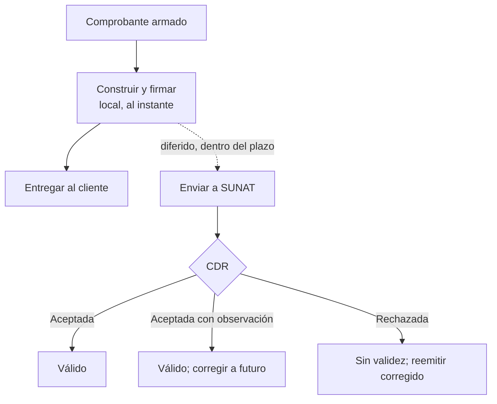

# Conceptos de dominio

Antes de usar quipu conviene tener claro el vocabulario y los flujos de la facturación electrónica peruana.
Esta página resume lo mínimo imprescindible.

## CPE y UBL

Un **Comprobante de Pago Electrónico (CPE)** es el documento que un emisor electrónico entrega a SUNAT por la
vía del sistema propio. El formato del XML es **UBL** (Universal Business Language), un estándar OASIS que
SUNAT adopta con anexos propios (`UBLExtensions`, `SUNATEmbededDespatchAdvice`, etc.).

::: warning No todo es UBL 2.1
La versión de UBL **no es la misma para todas las familias**: **2.1** para factura, boleta, notas y guías
(09/31); **2.0** para resumen diario (RC), comunicación de baja (RA), reversión (RR), retención (20) y
percepción (40). No es una decisión de quipu: la fija el esquema que SUNAT exige para cada familia. Ver la
tabla en [validación local](/guias/validacion-local#no-todo-valida-contra-ubl-2-1).
:::

quipu construye ese XML con DOM, lo firma y lo envía. El consumidor arma un `Model\*` (un DTO tipado) y quipu
elige el esquema y la versión que corresponden al tipo de documento.

## Tipos de comprobante

Son los **once** que modela `Catalog\DocumentType`:

| Documento | Código (Cat. 01) | Cuándo | Serie |
|---|---|---|---|
| Factura electrónica | `01` | Cliente con RUC que la solicita | `F001` |
| Boleta de venta electrónica | `03` | Cliente consumidor final (B2C) | `B001` |
| Nota de crédito | `07` | Anulaciones, devoluciones, descuentos | Ligada al original |
| Nota de débito | `08` | Ajustes al alza (intereses, cargos) | Ligada al original |
| Guía de remisión remitente | `09` | Transporte de bienes (emite el remitente) | `T001` |
| Guía de remisión transportista | `31` | Transporte de bienes (emite el transportista) | `V001` |
| Comprobante de retención | `20` | Agente de retención | `R001` |
| Comprobante de percepción | `40` | Agente de percepción | `P001` |
| Resumen diario (RC) | `RC` | Reporte consolidado de boletas | — |
| Comunicación de baja (RA) | `RA` | Baja de comprobantes | — |
| Resumen de reversiones (RR) | `RR` | Baja de retenciones/percepciones | — |

::: tip Serie y correlativo
Cada tipo lleva su propia **serie** (`F001`, `B001`, …) y dentro de ella un **correlativo** numérico incremental.
El correlativo debe ser **atómico**: sin huecos ni duplicados, incluso bajo concurrencia. quipu **no** gestiona
la numeración —ese es trabajo del consumidor—; solo la recibe en el `Model\*`.
:::

## Los cuatro mecanismos de reporte

No hay un único camino a SUNAT: hay **cuatro**, y el tipo de documento decide cuál te toca.

| Mecanismo | Método de `Quipu` | Respuesta | Para qué documentos |
|---|---|---|---|
| Envío individual | `sendBill()` (vía `emit()` / `emitInvoice()`) | **CDR síncrono** en la misma respuesta | Factura (`01`), boleta (`03`), notas (`07`/`08`), retención (`20`), percepción (`40`) |
| Consolidado asíncrono | `sendSummary()` + `getStatus()` | **Ticket** → polling → **un** CDR | Resumen diario (`RC`, que consolida las boletas del día), comunicación de baja (`RA`), reversión (`RR`) |
| Lote asíncrono | `sendPack()` + `getPackStatus()` | **Ticket** → polling → **un CDR por documento** | Hasta 500 facturas, boletas y notas en un solo ZIP |
| GRE (REST, no SOAP) | `emitGuide()` + `getGuideStatus()` | **Ticket** → polling → CDR | Guías de remisión (`09`, `31`) |

Los tres primeros son SOAP; el cuarto es una **API REST con OAuth** aparte, que exige inyectar un `GreSender` en
el constructor de `Quipu` (sin él, `emitGuide()` lanza `TransportException`). Ver
[guía de remisión](/documentos/guia-remision).

::: warning No mezcles `getStatus()` y `getPackStatus()`
Cada ticket se consulta con el método de su mecanismo. `getStatus()` resuelve **un** CDR (el del consolidado);
`getPackStatus()` devuelve **uno por documento** del lote. Usar el que no toca no lanza excepción: pierde datos
en silencio. Ver [lotes](/guias/lotes).
:::

Los envíos individuales de retención y percepción, y el consolidado de reversión, viajan además a un **host
distinto** (`otherCpeUrl()`) del resto. Ver [endpoints](/referencia/endpoints).

::: tip La boleta admite más de un camino
Que la boleta aparezca en varias filas no es un error. El mecanismo **estándar** —el que SUNAT espera— es el
**Resumen Diario**, que la consolida con las demás del día. Pero también puede enviarse **individualmente** con
`emitInvoice()` y recibir su CDR síncrono, igual que una factura, o ir dentro de un lote `sendPack()`. El
resumen es la vía normal; el individual es opcional. Ver [boleta](/documentos/boleta) y
[resumen diario](/documentos/resumen-diario).
:::

## El CDR

La **Constancia de Recepción (CDR)** es la respuesta de SUNAT que acredita qué hizo con el comprobante. Sin un
CDR aceptado, un comprobante no está plenamente informado. Tiene tres estados:

| Estado | Significado | Validez |
|---|---|---|
| **Aceptada** | SUNAT validó el comprobante | Válido, plena validez |
| **Aceptada con observación** | Válido, con datos reparables | Válido; corregir en futuras emisiones |
| **Rechazada** | No aceptado | **Sin validez** → emitir uno nuevo corregido |

quipu parsea el CDR y devuelve un `Result\CdrResult` tipado con el estado, código de respuesta, descripción,
observaciones y una **severidad** derivada del código (útil para decidir si reintentar).

## El principio "emitir local / reportar diferido"

> [!IMPORTANT]
> **Emitir el comprobante localmente al instante; reportarlo a SUNAT en diferido.**

El documento se genera, firma y entrega al cliente **en el acto**, sin esperar a SUNAT. El reporte ocurre
**después**, dentro de la ventana de días que dan los plazos. Así, el camino crítico de la venta **nunca
depende** de la disponibilidad de SUNAT (cuyos webservices se caen con frecuencia).

quipu refleja este principio en su API: [`sign()`](/arquitectura/facade) construye y firma localmente (instantáneo),
mientras que [`sendBill()`](/arquitectura/facade) hace el reporte a SUNAT (separable, diferible).

## El día tributario se corta en `America/Lima`

El **día tributario es día calendario de Lima**, no el día UTC del servidor. El Resumen Diario agrupa boletas
por día de Lima; los plazos se cuentan en días calendario de Perú. Recomendación: persistir en UTC y convertir
a `America/Lima` **solo** en los cortes y en los documentos.

## Catálogos SUNAT

SUNAT publica catálogos numéricos que tipifican valores obligatorios: tipo de documento (Cat. 01), moneda
(Cat. 02), unidad de medida (Cat. 03), tipo de afectación IGV (Cat. 07), motivos de nota (Cat. 09/10), tipo
de operación (Cat. 51), leyendas (Cat. 52), etc. quipu los modela como **enums** en `Catalog\`, donde el
*value* es el código oficial y el *case name* está en inglés.

Ver la [referencia de catálogos](/referencia/catalogos) para el detalle.

## Siguiente paso

Con los conceptos claros, pasa al [inicio rápido](/empezando/inicio-rapido) para emitir tu primera factura.
