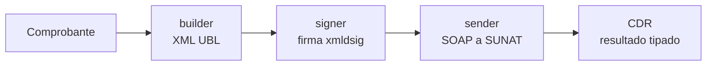

# Inicio rápido

Esta guía muestra cómo emitir una **factura electrónica** contra **SUNAT beta** y parsear su CDR. Es el flujo
completo —construir, firmar, enviar— en una sola llamada, y puedes ejecutarlo hoy sin trámites: beta tiene
credenciales públicas y acepta un certificado autofirmado. Producción es el mismo código con otro endpoint y tus
credenciales; lo cubre [de beta a producción](/produccion/de-beta-a-produccion).

## Idea general

quipu expone un facade, `Quipu`, que orquesta tres piezas inyectables:

- un **builder** (`XmlBuilder`) que convierte un `Model\*` en XML UBL (2.1 o 2.0 según el tipo),
- un **signer** (`Signer`) que firma el XML con tu certificado,
- un **sender** (`Sender`) que lo envía a SUNAT por SOAP y devuelve el CDR.

El consumidor arma el comprobante, llama a `emitInvoice()` y recibe un `BillResult` con el CDR.



## Ejemplo completo (contra SUNAT beta)

<Availability lite pro />

Este ejemplo apunta a **SUNAT beta** (homologación) con las **credenciales públicas de prueba**, así que puedes
copiarlo, pegarlo y ejecutarlo tal cual. Es el mismo flujo que el script `examples/emit-invoice-beta.php` del
repositorio, cuya factura fue **aceptada** por beta.

<CodeTabs>
<template #php>

```php
<?php

declare(strict_types=1);

require __DIR__ . '/vendor/autoload.php';

use ElPandaPe\Quipu\Catalog\Currency;
use ElPandaPe\Quipu\Catalog\DocumentType;
use ElPandaPe\Quipu\Catalog\IdentityDocumentType;
use ElPandaPe\Quipu\Catalog\IgvAffectationType;
use ElPandaPe\Quipu\Catalog\LegendCode;
use ElPandaPe\Quipu\Catalog\OperationType;
use ElPandaPe\Quipu\Catalog\UnitOfMeasure;
use ElPandaPe\Quipu\Model\Address;
use ElPandaPe\Quipu\Model\Client;
use ElPandaPe\Quipu\Model\Company;
use ElPandaPe\Quipu\Model\Invoice;
use ElPandaPe\Quipu\Model\Legend;
use ElPandaPe\Quipu\Model\SaleDetail;
use ElPandaPe\Quipu\Quipu;
use ElPandaPe\Quipu\Signer\XmlSecSigner;
use ElPandaPe\Quipu\Ws\SoapEndpoints;
use ElPandaPe\Quipu\Ws\SoapSender;
use ElPandaPe\Quipu\Xml\InvoiceBuilder;

// 1) Tu certificado en PEM (cert + llave privada concatenados). Contra beta basta uno autofirmado.
//    file_get_contents() devuelve false si el archivo no existe: compruébalo, o bajo strict_types
//    el error aflora más tarde como un TypeError opaco dentro del signer.
$certificate = file_get_contents(__DIR__ . '/certificate.pem');
if ($certificate === false) {
    fwrite(STDERR, "No se pudo leer certificate.pem\n");
    exit(1);
}

// 2) Endpoint de beta y credenciales públicas de prueba (RUC 20000000001 / MODDATOS).
$endpoint = SoapEndpoints::beta()->billServiceUrl();
$username = '20000000001MODDATOS';
$password = 'moddatos';

// 3) El documento a emitir (un DTO readonly, inmutable).
$invoice = new Invoice(
    documentType: DocumentType::Invoice,
    series: 'F001',
    number: '1',
    issueDate: new DateTimeImmutable(),
    operationType: OperationType::InternalSale,
    currency: Currency::Sol,
    company: new Company(
        ruc: '20000000001',
        legalName: 'EMPRESA DE PRUEBA SAC',
        tradeName: 'QUIPU DEMO',
        address: new Address(
            ubigeo: '150101',
            department: 'LIMA',
            province: 'LIMA',
            district: 'LIMA',
            line: 'AV. SIEMPRE VIVA 123',
        ),
    ),
    client: new Client(
        documentType: IdentityDocumentType::Ruc,
        documentNumber: '20000000001',
        legalName: 'CLIENTE DE PRUEBA SAC',
    ),
    details: [
        new SaleDetail(
            productCode: 'P001',
            unit: UnitOfMeasure::Unit,
            description: 'PRODUCTO DE PRUEBA',
            quantity: 2.0,
            unitValue: 100.0,
            unitPrice: 118.0,
            lineValue: 200.0,
            igvAffectation: IgvAffectationType::TaxedOnerous,
            igvBaseAmount: 200.0,
            igvPercentage: 18.0,
            igvAmount: 36.0,
            taxTotal: 36.0,
        ),
    ],
    legends: [new Legend(LegendCode::AmountInWords, 'SON DOSCIENTOS TREINTA Y SEIS CON 00/100 SOLES')],
    taxableAmount: 200.0,
    igvAmount: 36.0,
    taxTotal: 36.0,
    saleValue: 200.0,
    totalAmount: 236.0,
    // No pasamos `paymentForm`: su default es PaymentForm::Cash (Contado). Ver la nota más abajo.
);

// 4) El facade con sus tres dependencias inyectadas.
//    InvoiceBuilder solo construye facturas y boletas; si emites más tipos, usa CompositeBuilder.
$quipu = new Quipu(
    new InvoiceBuilder(),
    new XmlSecSigner($certificate),
    new SoapSender($endpoint, $username, $password),
);

// 5) Emitir: construir + firmar + enviar a SUNAT + parsear el CDR.
$result = $quipu->emitInvoice($invoice);

$cdr = $result->cdr;
printf("Documento:   %s\n", $invoice->fileName());
printf("Estado:      %s\n", $cdr->status->value);
printf("Código:      %s\n", $cdr->responseCode);
printf("Descripción: %s\n", $cdr->description);

foreach ($cdr->notes as $note) {
    printf("Observación: %s\n", $note);
}
```

</template>
</CodeTabs>

Aquí inyectamos `InvoiceBuilder` porque solo emitimos facturas: ese builder sabe construir facturas y boletas
(ambas son `Invoice`). Si tu aplicación emite varios tipos de documento, inyecta `CompositeBuilder`,
que despacha al builder adecuado según el documento. Ver [factura](/documentos/factura).

::: tip Beta acepta un certificado autofirmado
Beta valida la estructura UBL y que la firma sea **criptográficamente válida**, no la autoridad del certificado.
Para desarrollo no necesitas el certificado tributario real: genera uno autofirmado siguiendo
[certificados digitales](/guias/certificados).
:::

::: warning `paymentForm` tiene un default invisible que te salva del rechazo 3244
El ejemplo omite `paymentForm`, pero **no** omite la *Forma de Pago* en el XML: el default del modelo es
`PaymentForm::Cash`, y `InvoiceBuilder` siempre emite el bloque `cac:PaymentTerms` con `FormaPago`.
Ese bloque es obligatorio desde la R.S. 000193-2020/SUNAT y es justo lo que valida el **rechazo 3244**. Si
vendes al crédito, pasa `paymentForm: PaymentForm::Credit` **y** las `installments` correspondientes.
:::

::: warning SUNAT beta rechaza repetidos
Beta rechaza una serie + correlativo ya enviado. Sube el `number` para reenviar el mismo ejemplo.
:::

## Entender el resultado

`emitInvoice()` devuelve un `BillResult` que envuelve un `CdrResult`:

<CodeTabs>
<template #php>

```php
$result = $quipu->emitInvoice($invoice);
$cdr = $result->cdr;

$cdr->status;          // CdrStatus::Accepted | AcceptedWithObservations | Rejected
$cdr->responseCode;    // código de SUNAT, p. ej. "0" = aceptado
$cdr->description;     // descripción del código
$cdr->notes;           // list<string> observaciones
$cdr->xml;             // ?string, el XML del CDR si SUNAT lo devolvió
$cdr->severity;        // ?CdrSeverity, severidad para decidir reintentos
$cdr->resolvedMessage; // ?string, el responseCode resuelto contra Error\ErrorCatalog (null si no está)
$cdr->isAccepted();    // bool, true salvo rechazo
```

</template>
</CodeTabs>

::: tip Revisa el estado antes de celebrar
`isAccepted()` es `true` tanto para *aceptada* como para *aceptada con observación*. Si necesitas distinguir,
compara `$cdr->status === CdrStatus::Accepted`. Un rechazo significa que el comprobante **no vale** y debes
emitir uno nuevo corregido.
:::

## Flujo en dos pasos (emitir local, reportar después)

Si quieres separar la firma local (instantánea, en el camino crítico de la venta) del envío a SUNAT (diferible),
usa `sign()` y `sendBill()` por separado:

<CodeTabs>
<template #php>

```php
// Al instante, en el punto de venta:
$signed = $quipu->sign($invoice);
file_put_contents('storage/xml/' . $invoice->fileName() . '.xml', $signed->xml);

// ...más tarde, en un job diferido:
$billResult = $quipu->sendBill($signed);
$cdr = $billResult->cdr;
```

</template>
</CodeTabs>

Este es el patrón recomendado en producción: el cliente recibe su comprobante sin esperar a SUNAT. Ver
[buenas prácticas](/buenas-practicas/como-usar).

## Pasar a producción

Cuando el flujo funcione en beta, el cambio de código es pequeño: el endpoint de producción, tu RUC real y tus
credenciales SOL.

<CodeTabs>
<template #php>

```php
$endpoint = SoapEndpoints::production()->billServiceUrl();
$username = $ruc . $solUser;  // RUC + usuario SOL secundario
$password = $solPassword;     // contraseña SOL
```

</template>
</CodeTabs>

::: danger No es solo cambiar el endpoint
En producción necesitas un **certificado tributario real** (el autofirmado ya no sirve), un usuario SOL
secundario, y los comprobantes tienen **efectos tributarios y plazos**. Lee
[de beta a producción](/produccion/de-beta-a-produccion) y el [checklist](/produccion/checklist) antes de emitir
el primer comprobante real.
:::

## Siguiente paso

- Profundiza en la [arquitectura](/arquitectura/vision-general) y el [facade](/arquitectura/facade).
- Revisa cada tipo de documento: [factura](/documentos/factura), [boleta](/documentos/boleta), [notas](/documentos/notas).
- Aprende a [validar localmente](/guias/validacion-local) antes de enviar.
- ¿Tu primer envío falla? Mira el [troubleshooting del debut](/guias/primer-envio).
