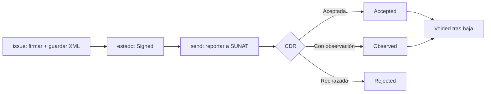

# Uso (base)

<Availability lite pro />

Todo lo de esta página funciona con **solo `quipu-lite`** instalado. Si además tienes `quipu-pro`, sigue
funcionando igual y se enriquece por debajo (ver [Edición Pro](/integraciones/laravel/pro)). Antes de emitir,
completa la [instalación y configuración](/integraciones/laravel/instalacion).

## Emitir un comprobante

El facade `Quipu` expone el emisor cableado en el contenedor. Para un envío directo, sin persistencia:

```php
use ElPandaPe\QuipuLaravel\Facades\Quipu;

$result = Quipu::emit($invoice);   // construye, firma y reporta a SUNAT

if ($result->cdr->isAccepted()) {
    // aceptado
}
```

Para el flujo completo **con persistencia, series/correlativos, estados, almacenamiento y eventos**, usa el
`DocumentDispatcher`:

```php
use ElPandaPe\QuipuLaravel\Dispatching\DocumentDispatcher;
use ElPandaPe\QuipuLaravel\Enums\State;

$record = app(DocumentDispatcher::class)->dispatch($invoice);

// $record es una fila Document; su estado refleja la respuesta de SUNAT.
match ($record->state) {
    State::Accepted => /* válido */ null,
    State::Observed => /* válido; corregir a futuro */ null,
    State::Rejected => /* sin validez; reemitir corregido */ null,
    default => null,
};
```

`dispatch()` es `issue()` + `send()`: puedes separarlos si quieres firmar y guardar primero (estado `Signed`) y
reportar a SUNAT después (por ejemplo, desde una cola). Una **rechazo** de SUNAT se registra como estado
`Rejected`, no se lanza como excepción; solo los fallos de transporte propagan, para que la cola pueda
reintentar.



Cada paso dispara su evento (ver más abajo).

::: tip Builders fluidos: `Quipu::invoice()`
Con la edición Pro instalada, el facade puede **sembrar** los builders con tu emisor y el motor tributario, de
modo que armes el comprobante con `Quipu::invoice($client)->addLine(...)->build()` en vez de construir el modelo
a mano. Es una capacidad Pro: ver [Motor tributario y builders](/integraciones/laravel/pro#motor-tributario-y-builders-fluidos).
:::

## Colas y jobs

- `SendDocumentJob` — envía un comprobante ya firmado de forma asíncrona.
- `PollTicketJob` — sondea un ticket de SUNAT (resúmenes y bajas devuelven ticket, no CDR inmediato).

Ambos corren sobre `config('quipu.queue.connection')`. El comando `quipu:send` encola por defecto (usa `--sync`
para enviar en el acto).

## Eventos

Registra listeners para reaccionar a cada resultado de SUNAT:

| Evento              | Cuándo se dispara                    | Carga                                         |
|---------------------|--------------------------------------|-----------------------------------------------|
| `DocumentIssued`    | Firmado y almacenado (estado `Signed`) | `Document`                                   |
| `CdrReceived`       | Llegó el CDR de SUNAT                 | `Document`, `CdrResult`                        |
| `DocumentAccepted`  | Aceptado (limpio u observado)        | `Document`, `CdrResult`                        |
| `DocumentRejected`  | Rechazado                            | `Document`, `CdrResult`, `?RejectionReport` (diagnóstico Pro) |
| `DocumentVoided`    | Dado de baja                         | `Document`                                     |

En `DocumentRejected`, el `RejectionReport` (con `action`, `remedy`, `retryable`) llega **solo con Pro** activo;
sin Pro es `null`. Ver [validación y diagnóstico de Pro](/integraciones/laravel/pro#validacion-avanzada-y-diagnostico).

## Comandos Artisan (base)

Siempre disponibles:

| Comando            | Qué hace                                              | Flags                          |
|--------------------|-------------------------------------------------------|--------------------------------|
| `quipu:install`    | Publica la configuración y las migraciones.           | —                              |
| `quipu:send`       | Envía los firmados pendientes (o uno).                | `--id=` · `--sync`             |
| `quipu:status`     | Consulta un ticket, o sondea los pendientes.          | `ticket?`                      |
| `quipu:summary`    | Envía un resumen diario / baja desde un archivo.      | `--file=` · `--disk=` · `--path=` |
| `quipu:read`       | Lee un XML de vuelta a su modelo tipado.             | `file` · `--disk=` · `--path=` |
| `quipu:cdr:fetch`  | Re-descarga el CDR de un comprobante ya declarado.   | `document` · `--disk=` · `--path=` · `--file=` |
| `quipu:doctor`     | Diagnóstico de la configuración.                     | —                              |
| `quipu:prune`      | Poda el almacenamiento (inbox).                      | `--days=30` · `--disk=` · `--path=` |

Los comandos que leen o escriben archivos aceptan `--disk=`, `--path=` y `--file=` para apuntar a otro disco
(incluido S3) o a otro archivo, sin tocar la configuración.

Con la edición Pro se añaden comandos extra y `quipu:doctor` se enriquece con el pre-flight del certificado:
ver [Comandos Pro](/integraciones/laravel/pro#comandos-artisan-pro).

## Siguiente paso

- Prueba tu integración sin red ni certificado en [Testing](/integraciones/laravel/testing).
- Descubre lo que activa [la edición Pro](/integraciones/laravel/pro).
