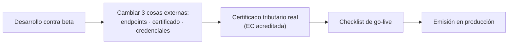

# De beta a producción

El salto a producción **no cambia tu código de dominio**: el XML, la firma, los modelos y la validación son
idénticos. Lo que cambia son **tres cosas externas** —endpoints, certificado y credenciales— y en el caso de la
GRE, algo más: el entorno beta que usas hoy **no es de SUNAT**.



## Qué cambia y qué no

| Pieza | Beta | Producción |
|---|---|---|
| Endpoints SOAP | `SoapEndpoints::beta()` | `SoapEndpoints::production()` |
| Endpoints GRE (REST) | `GreEndpoints::beta()` — ⚠️ **mock de la comunidad** | `GreEndpoints::production()` — SUNAT |
| Certificado | Autofirmado de prueba (beta lo acepta) | **Certificado tributario real** de una EC acreditada |
| Credenciales SOAP | `20000000001MODDATOS` / `moddatos` (públicas) | Tu RUC + usuario SOL **secundario** + su clave |
| Credenciales GRE | Las del mock | `client_id` / `client_secret` reales de SUNAT |
| **Tu código de emisión** | — | **Sin cambios** (mismos `Model\*`, `sign()`, `emit()`) |

## El cambio, en código

<CodeTabs>
<template #php>

```php
use ElPandaPe\Quipu\Ws\SoapEndpoints;
use ElPandaPe\Quipu\Ws\SoapSender;

// Beta
$sender = new SoapSender(
    SoapEndpoints::beta()->billServiceUrl(),
    '20000000001MODDATOS',
    'moddatos',
);

// Producción
$sender = new SoapSender(
    SoapEndpoints::production()->billServiceUrl(),
    $ruc . $usuarioSol,   // p. ej. '20512345678MIUSUARIO'
    $claveSol,
);
```

</template>
</CodeTabs>

Nada más de la cadena cambia: `$quipu->emitInvoice($invoice)` sigue igual.

> [!TIP]
> No cablees el entorno. Resuelve `SoapEndpoints::beta()` o `::production()` desde configuración, para que el
> mismo binario sirva en ambos entornos. Si emites para varios contribuyentes, mira
> [Multi-tenant](/guias/multi-tenant): quipu es *stateless* respecto al emisor y recibe cert y credenciales por
> inyección.

## Cuatro trampas del entorno beta

### 1. La GRE beta no es de SUNAT

`GreEndpoints::beta()` apunta a `https://gre-test.nubefact.com`, un **mock mantenido por la comunidad**, no un
host de SUNAT. Sirve para probar la integración, pero **no es homologación oficial** y no garantiza que
producción se comporte igual.

<CodeTabs>
<template #php>

```php
GreEndpoints::beta();        // https://gre-test.nubefact.com  ← mock comunitario
GreEndpoints::production();  // https://api-seguridad.sunat.gob.pe + https://api-cpe.sunat.gob.pe
```

</template>
</CodeTabs>

En producción, la GRE usa **OAuth** contra SUNAT con `client_id`/`client_secret` que debes solicitar; no es el
mismo mecanismo que la Clave SOL del SOAP.

### 2. La consulta de tu propio CPE no existe en beta

`billConsultService` (`getBillStatus()` / `retrieveCdr()`) **solo existe en producción**. Por eso
`SoapEndpoints::beta()` y `::production()` devuelven **la misma** `consultBaseUrl` — no es un descuido:

<CodeTabs>
<template #php>

```php
SoapEndpoints::beta()->consultUrl();        // apunta a e-factura (producción)
SoapEndpoints::production()->consultUrl();  // idéntico
```

</template>
</CodeTabs>

Consecuencia práctica: **no puedes probar esa consulta en beta**. Con credenciales de beta contra ese endpoint
obtendrás un fallo de autenticación, no un resultado de prueba.

### 3. La Consulta Integrada tampoco tiene beta

`CpeValidityEndpoints::beta()` devuelve literalmente `CpeValidityEndpoints::production()`. Esa API (validez de CPE de
terceros) no tiene entorno de pruebas.

### 4. Beta no valida las reglas de negocio

Es la trampa más cara, porque da falsa confianza. SUNAT dice de su servicio beta que *"solo sirve para realizar
pruebas a las estructuras XML"* y que **no hace verificaciones de consistencia de datos**.

Consecuencia: **un verde en beta no garantiza que producción acepte el mismo documento**. El motor de reglas
completo —el que un día decide que la Forma de Pago pasa a ser obligatoria— solo se ejerce en producción.

> [!WARNING]
> Beta valida que tu XML esté **bien formado**, no que sea **correcto**. Trátalo como un chequeo de estructura,
> no como una homologación. Las reglas de negocio se vigilan aparte: ver
> [Vigilancia de cambios de SUNAT](/produccion/vigilancia-sunat).

Nota terminológica: la **homologación** como proceso formal de SUNAT fue **derogada** (R.S. 287-2017). Hoy
"beta" es un servicio de pruebas, no un trámite que acredite nada.

## El certificado

En beta usas un **certificado autofirmado de prueba** que generas tú con `openssl`:

```bash
openssl req -x509 -newkey rsa:2048 -keyout key.pem -out cert.pem -days 3650 -nodes \
  -subj "/C=PE/ST=Lima/L=Lima/O=MI EMPRESA TEST/OU=Facturacion/CN=20000000001"
cat cert.pem key.pem > certificate.pem
rm cert.pem key.pem
```

El `CN` lleva el RUC de prueba `20000000001` y SUNAT beta lo acepta. En producción necesitas un **certificado
digital tributario** emitido por una entidad de certificación acreditada, en PEM (certificado + llave privada
concatenados, sin passphrase). El formato, la conversión desde `.pfx` y la validación previa están en
[Certificados digitales](/guias/certificados).

> [!WARNING]
> El certificado **caduca**. Un certificado vencido detiene la emisión por completo. Ponle una alerta con
> antelación; renovarlo no es inmediato.

## Antes de lanzar

No basta con cambiar las URLs. Revisa el [checklist de go-live](/produccion/checklist) — cubre lo que quipu
**no** hace por ti (correlativos, persistencia, plazos) y los puntos regulatorios que deben re-verificarse
contra la norma vigente antes de emitir de verdad.

## Siguiente paso

- [Checklist de go-live](/produccion/checklist)
- [Operación en producción](/produccion/operacion) — qué persistir, reintentos, conservación.
